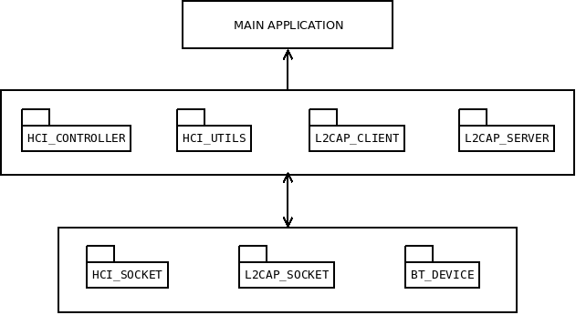

# BlueZ tools

**bluez_tools** is a set of C99 modules aiming to provide an user-friendly upper layer to the well-known Bluetooth library [BlueZ](http://www.bluez.org/). Each module targets a different aspect: from the Bluetooth adapter (dongle) management to the creation and management of fully functionnal L2CAP-based servers.

This project is the conclusion of a school project done in may 2014. The goal of this project was to provide a way to implement an indoor positionning system based on Bluetooth LE (Low Energy). In order to do so I created an API for my team to use BlueZ functionnalities with more ease. Since the BlueZ API is not very well documented itself (its documentation lies in the [official Bluetooth core specification](https://www.bluetooth.com/specifications/adopted-specifications)) it was essential to provide a more easy-to-use layer. The bluez_tools modules are the latest representation of this API.

The end-product of the previous school project is given as an example of the bluez_tools use. The main setup was as follow: three Raspberry Pis with Bluetooth dongles attached to them where used as servers receiving RSSI data through L2CAP protocole over Bluetooth from a Bluetooth beacon attached to a person in the room. The computed RSSI data, having been previously calibrated, are then computed to locate the relative coordinates of the beacon inside the room. This school project was created by the ENSIMAG FabLab team : BERTAULD Thomas, BIANCHERI Cédric, BRELOT Lucie and FONT Ludovic.

**Key features**:

  * User-friendly API: the provided modules are a wrapper on the BlueZ library, taking care for you of the error handling and low-level return values, allowing you to concentrate on coding your application.
  * Safe: internal mechanicals are in place to ensure as little error cases as possible. For instance, the Bluetooth adapter's HCI is seen as a state machine, allowing you to recover from a potential lockout (say for instance if the dongle stays in the "scan" mode).
  * Both low-level and high-level management: functions exist for both low-level management such as sockets management as well as for high-level management such as the creation of a Bluetooth server using the L2CAP protocole.
  * Modularity: each module can be used separately (though all rely on the "bt" one) and it's easy to reuse the existing ones to create even higher layers or to enhance the core functionnalities. 
 
**Current limitations**:

  * Non-optimal performances: the use of heavy-load functions such as strings concatenation or snprintf to compute RSSI inquiries and the mechanisms in place to ensure the functionnalities safety can affect the performances of the application.
  * The creation of a L2CAP server currently leads to the creation of a thread for each connected client.

**Requirements**:

  * BlueZ v5.2 or higher

## Modules overview


 
## Using

### Compiling and installing the modules

  1. You first need to edit the **headers** to ensure that the modules
     are configured to suit your needs (especially regarding the timeout set
     to access the controller or to send an inquiry). 

  2. Then simply compile the modules using the Makefile provided in the **src** directory. You can specify whether or not to use a cross-compiling toolchain by setting the CROSS_COMPILE flag. You can also decide if you rather want the resulting
     libraries to be static (.a) or shared (.so) by setting the LIBTYPE flag. The default behavior is to produce a shared library.

```sh
    make
```
  Or

```sh
    make LIBTYPE=so
```

If everything went well, the library should have been produced in the **lib**
folder.

  3. You can now install the library and the required headers. The **INSTALL_LIB_PATH** and **INSTALL_H_PATH** flags can be set to provide a custom installation path. The default values are /usr/local/lib and /usr/local/include

```sh
    make install
```
  Or

```sh
    make install INSTALL_LIB_PATH=/home/my/path
```

You can also re-compile the provided documentation by using the Makefile inside the **doc** directory.

#### Compiling your code

Now that we have everything ready, we just need to compile our application.

First of all, make sure that the previously generated library can be
found by the compiler/linker. Assuming that you're using gcc, you just need to
specify the -L option :

```sh
    gcc -L path/to/libraries/
 ```

You will then have to build the host program using the **lbluez_tools** library:

```sh
    gcc -L path/to/libraries/ main.c -lbarelog_logger
```

Of course, this need to be adapted in case you use another compiler.

## Testing

#### Unit tests

Some modules provide a unit test case that can be performed by enabling the right pre-processor macro. For instance, you can build a test-case for the hci_socket module by defining the **HCI_SOCKET_TEST** macro.

A single test for RSSI measurement is also provided under the **tests** directory.

### Build the demo 

As previously said, the demo is to run on three L2CAP servers in charge of receiving RSSI values, a beacon in charge of sending those values and a L2CAP client computing all the RSSI values coming from the three servers, thus creating a **triangulation** system. The setup we used was as follow:
  * A TI Bluetooth LE beacon was the target to track.
  * Three Raspberry Pis equiped with Bluetooth dongles were used as servers, receiving RSSI measures from the beacon.
  * A laptop was used as the computation system (client), receiving data from the three servers.
  * The data were then sent to a visualization application which is not part of this demo.
 
To compile the demo simply use the provided makefile:

```sh
   make 
   make server
```
The first command will build the client's side of the application and the second one the servers side.
